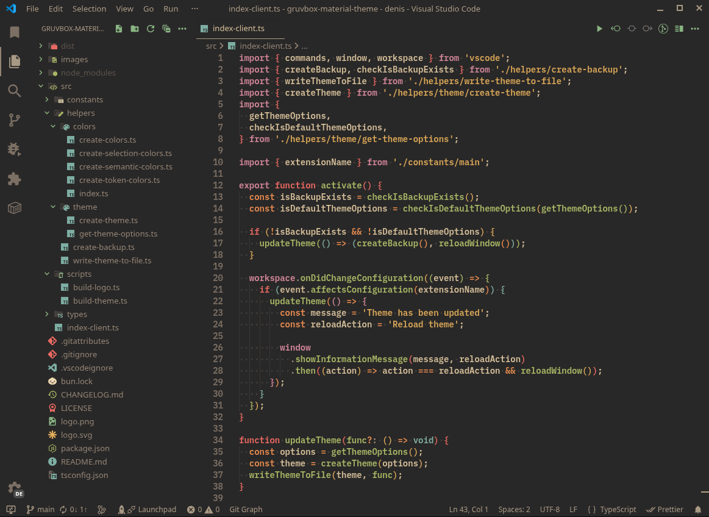
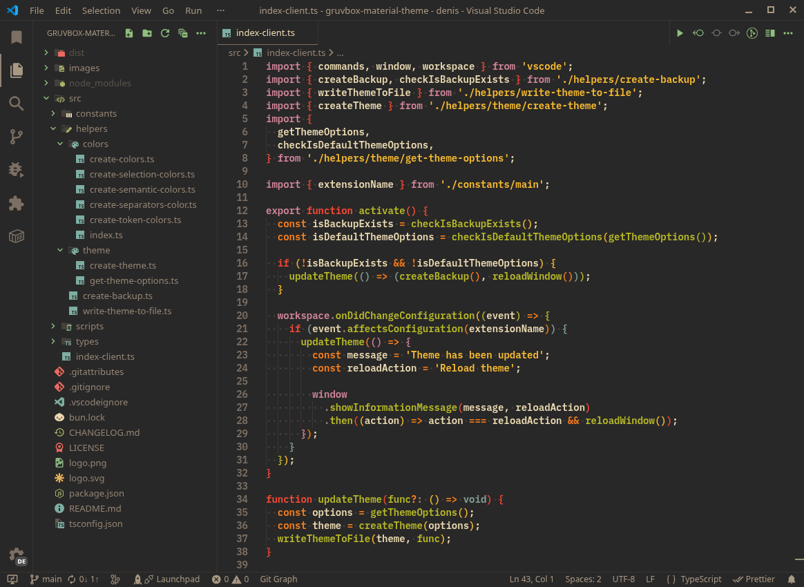
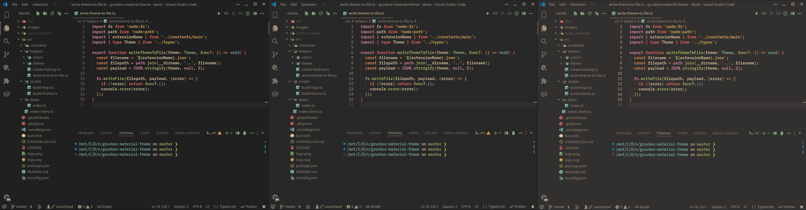

<!-- markdownlint-disable heading-start-left first-line-h1 -->
<h1 align="center">
   
  
   
   
    Gruvbox Material Theme
   
</h1>

<h3 align="center">
  Recommended icon set: 
  <a href="https://github.com/navernoedenis/gruvbox-material-icons">Gruvbox Material Icons</a>
</h3>

  &nbsp;
  &nbsp;
  &nbsp;

<h2 align="center">Palette: Material</h2>

<h2 align="center">Palette: Classic</h2>

<h2 align="center" style="margin-bottom: 0;">Contrasts</h2>

<h3 align="center">
  Hard
  |
  Medium
  |
  Soft
</h3>

<h2 align="center">Special Thanks</h2>

  

    A huge thanks to these projects for inspiring and shaping the color palette used in this theme:
  

  

    <a href="https://github.com/sainnhe/gruvbox-material-vscode">sainnhe/gruvbox-material-vscode</a>
     
    Primary reference for the Material palette, contrast tuning, and overall color balance.
  

  

    <a href="https://github.com/morhetz/gruvbox">morhetz/gruvbox</a>
     
    The original Gruvbox palette that laid the foundation for the colors and aesthetics.
  

<h2 align="center">Additional information</h2>

 

    - There are currently no plans to add a light (white) theme.
  

 

    - The font used in the screenshots is "IBM Plex Mono".
  

