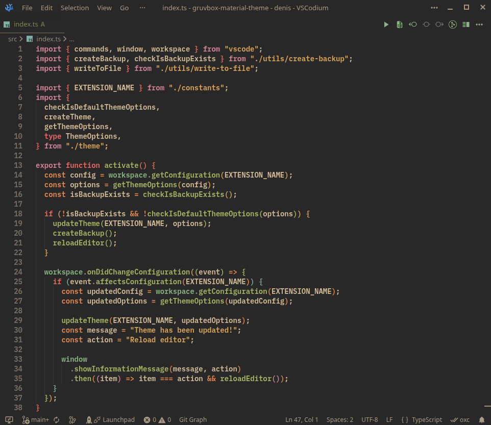
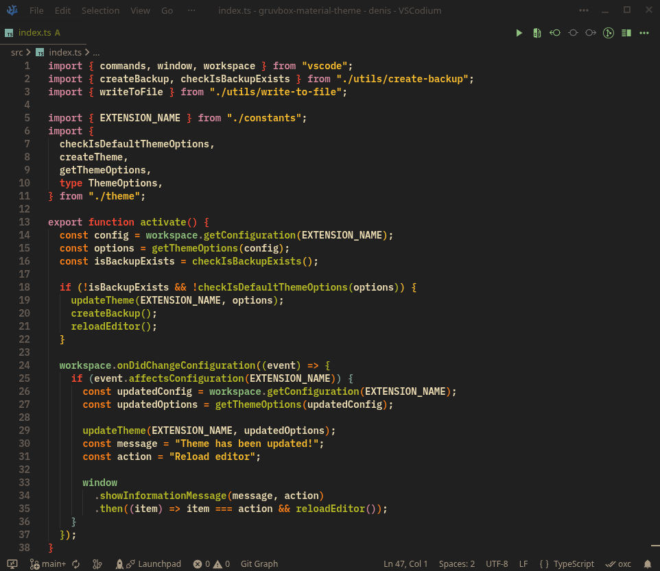
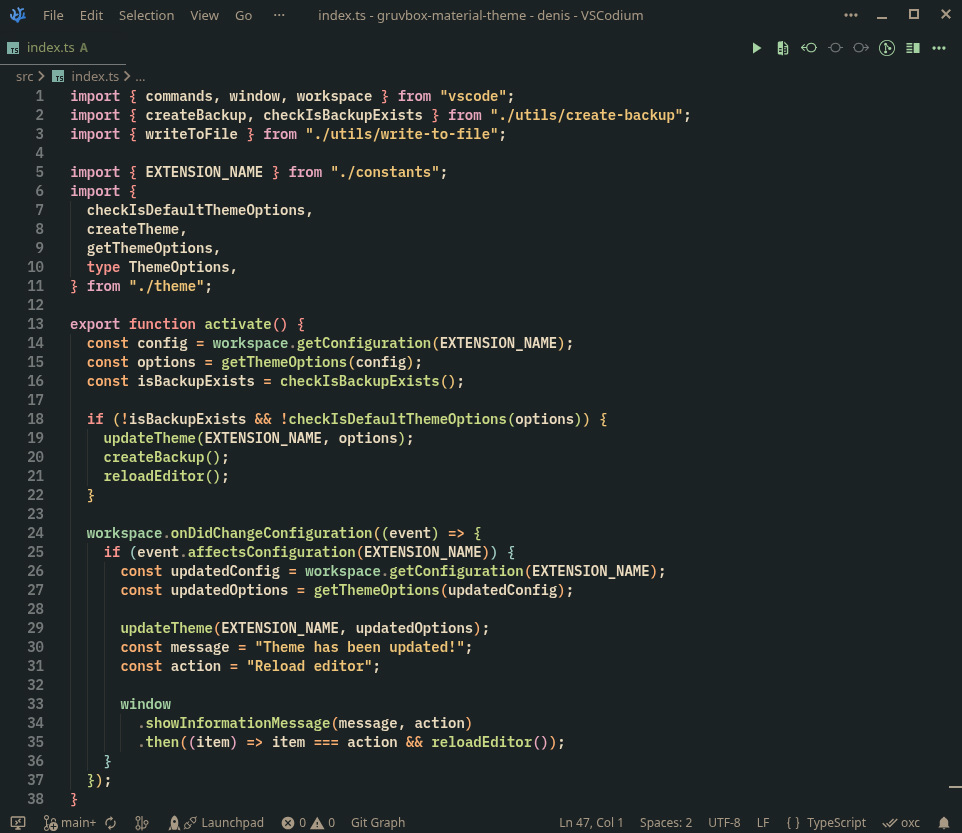

<!-- markdownlint-disable heading-start-left first-line-h1 -->
<h1 align="center">
     
    Gruvbox Theme (Material)
   
</h1>

<h3 align="center">
  Try it with 
  <a href="https://github.com/navernoedenis/gruvbox-material-icons">Gruvbox Icons (Material)</a>
</h3>

  &nbsp;
  &nbsp;
   

<h4 align="center">Contrast: Medium, Palette: Material</h4>

<h4 align="center">Contrast: Hard, Palette: Classic</h4>

<h4 align="center">Contrast: Slate, Palette: Pastel</h4>

<h3 align="center">Special Thanks</h3>

  

    A huge thanks to these projects for inspiring and shaping the color palette used in this theme
  

  

    <a href="https://github.com/sainnhe/gruvbox-material-vscode">sainnhe/gruvbox-material-vscode</a>
     
    Primary reference for the Material palette, contrast tuning and overall color balance
  

  

    <a href="https://github.com/morhetz/gruvbox">morhetz/gruvbox</a>
     
    The original Gruvbox palette that laid the foundation for the colors and aesthetics
  

<h3 align="center">Additional information</h3>

 
 - There are currently no plans to add a light (white) theme

 
 - The font used in the screenshots is "IBM Plex Mono"

